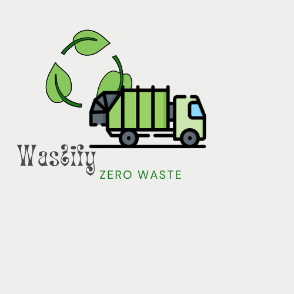

# WASTIFY

An end-to-end recyclable waste management website. 

## Problem Statement

Waste management is a critical global challenge, and proper segregation of waste is crucial for effective recycling. The challenge is to develop an Object Recognition Application that uses computer vision to identify and segregate waste items into recyclable and non-recyclable categories. This application aims to streamline the waste management process, promoting environmental sustainability.

## Objectives

The primary goal of this challenge is to design and implement an Object Recognition Application that utilizes computer vision to accurately identify and segregate waste items into recyclable and non-recyclable categories. The application should enhance the efficiency of waste management processes and promote sustainable practices.

- To bridge the gap between various stake holders of the Recyclable Waste ecosystem.
- Facilitate a dynamic website to users with a personalized experience to each one.
- Help the user to schedule pickup according to their convenience.

## Functional Requirements

1. Image Recognition Algorithm:
   ○ Implement a robust image recognition algorithm capable of identifying various waste
   items with high accuracy.
2. Recyclable and Non-recyclable Classification:
   ○ Develop classification models that can differentiate waste items into recyclable and
   non-recyclable categories based on the recognized images.
3. Real-time Processing:
   ○ Ensure the application can process images in real-time, making it practical for use in
   waste processing facilities or even in mobile applications for individuals.
4. Integration with Robotics:
   ○ Explore the possibility of integrating the application with robotic systems for
   automated waste segregation in large-scale facilities.

## TechStack Used

- HTML
- CSS
- JavaScript
- NodeJS
- MongoDB
- ExpressJS
- ReactJS
- Python
-

## Tools Used

<!-- * Firebase
* SwiperJS -->

- Figma
- TensorFlow.js
- Pytorch

## Contributors

| Profile                                      | Name             | GithubID                                                   | EmailID                       | LinkedIN                                                                   |
| -------------------------------------------- | ---------------- | ---------------------------------------------------------- | ----------------------------- | -------------------------------------------------------------------------- |
|  | Kartik Sharma    | [@Kartik Sharma](https://github.com/Kartikay45)            | sharma.kartik22a@gmail.com    | [kartik-Sharma](https://www.linkedin.com/in/kartik-sharma-29a9b824a/)      |
|      | Utkarsh Sharma   | [@Utkarsh-Sharma](https://github.com/02utkarsh)            | utkatsh7424sharma@gmail.com   | [Utkarsh Sharma](https://www.linkedin.com/in/utkarsh-sharma-90b763237/)    |
|    | Dhruv Khandelwal | [@DHRUVKHANDELWAL))](https://github.com/DHRUVKHANDELWAL00) | khandelwaldhruv2003@gmail.com | [dhruvkhandelwal](https://www.linkedin.com/in/dhruv-khandelwal-2332a81a3/) |

## Successfull Deployment

The website is up and running. One can check the live deployment [here](https://redivivuspickupguy.web.app/). 

<!-- ## ➤ Homepage:

## ➤ Our Services:

## ➤ About Us:

## ➤ Contact:

## ➤ Dev Team:
 -->

    <i>2023© Wastify.  
    All Rights Reserved.  
    (This website was created by Block Overflow team.)</i>

